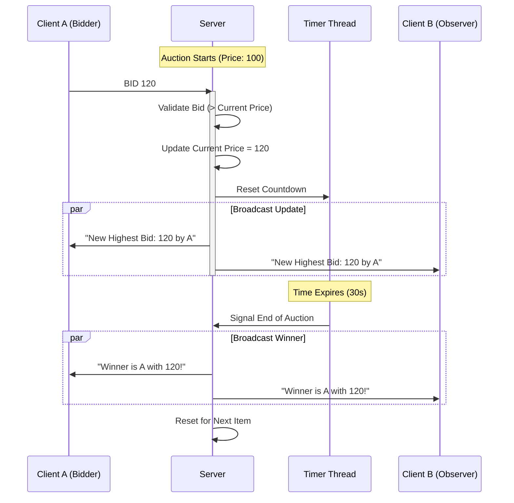

<div align="center">

# 🌐 Network Programming Masterclass


<br>

**A high-performance portfolio of distributed systems, real-time applications, and network protocols.**
<br>
*Explore the power of Java Socket Programming through practical, robust implementations.*

[Report Bug](https://github.com/capkimkhanh/LTM/issues) · [Request Feature](https://github.com/capkimkhanh/LTM/issues)

</div>

---

## 📖 Table of Contents
- [✨ Overview](#-overview)
- [🏗 System Architecture](#-system-architecture)
- [🚀 Project Showcase](#-project-showcase)
- [💻 Technical Deep Dive](#-technical-deep-dive)
- [📂 Repository Structure](#-repository-structure)
- [⚡ Getting Started](#-getting-started)
- [👨‍💻 Author](#-author)

---

## ✨ Overview

This repository represents a comprehensive journey through **Network Programming (Lập Trình Mạng)**. It goes beyond simple "Hello World" socket examples to build fully functional, fault-tolerant, and concurrent systems.

**Core Competencies Demonstrated:**
*   **Protocol Mastery**: Deep implementation of both **TCP** (Connection-oriented) and **UDP** (Datagram-based) protocols.
*   **Concurrency Patterns**: Utilizing `ExecutorService`, `Thread Pools`, and synchronization blocks to handle thousands of concurrent requests.
*   **Real-Time Communication**: Building low-latency broadcast systems for auctions and screen sharing.
*   **Distributed Logic**: Managing state across multiple clients and servers.

---

## � System Architecture

### Real-Time Auction Flow (TCP)
The following diagram illustrates the complex interaction in the **Auction System** (`OnCK/Bai5`), where the server manages state, timer, and broadcasts updates to all connected clients.



---

## 🚀 Project Showcase

| Project | Type | Description | Key Tech | Status |
| :--- | :---: | :--- | :--- | :---: |
| **Real-Time Auction** | `TCP` | A competitive bidding platform with live updates, countdown timers, and session management. | `Socket` `Threads` `Timer` | 🟢 Ready |
| **Currency Exchange** | `UDP` | Distributed exchange rate server handling high-throughput, stateless conversion requests. | `Datagram` `Stateless` | 🟢 Ready |
| **Screen Sharing** | `TCP/UDP` | Remote desktop tool capturing and streaming screen data to multiple clients. | `Robot` `BufferedImage` | 🟡 Beta |
| **Network Discovery** | `Util` | Utilities for IP scanning, port checking, and network interface analysis. | `InetAddress` `NetworkInterface` | 🟢 Ready |

---

## 💻 Technical Deep Dive

### 1. Handling Concurrency with `ExecutorService`
Instead of creating a new thread for every client (which is resource-heavy), the server uses a Cached Thread Pool. This ensures optimal resource usage while maintaining high responsiveness.

```java
// Server.java Snippet
ServerSocket serverSocket = new ServerSocket(5001);
ExecutorService executorService = Executors.newCachedThreadPool();

while (true) {
    Socket soc = serverSocket.accept(); // Accept connection
    serverHandle handle = new serverHandle(soc); // Create handler
    executorService.execute(handle); // Dispatch to thread pool
}
```

### 2. The "Push" Model (Broadcast)
In the Auction system, clients don't poll for updates. The server maintains a list of active sockets and "pushes" data whenever a state change occurs.

> [!IMPORTANT]
> **Synchronization is Key**: When iterating through the list of connected clients to broadcast a message, the list must be synchronized to prevent `ConcurrentModificationException` if a client disconnects simultaneously.

---

## 📂 Repository Structure

```text
Code/
├── 📂 Bai1/               # Network Discovery & IP Tools
├── 📂 ExchangeMoney/      # UDP Currency Exchange System
├── 📂 ShareScreen/        # TCP Screen Sharing Implementation
├── 📂 ShareScreenUDP/     # UDP High-Performance Screen Share
├── 📂 OnCK/               # Advanced Projects & Exam Revision
│   ├── 📂 Bai5/           # 🏆 The Auction System
│   └── ...
└── 📄 readme.md           # You are here
```

---

## ⚡ Getting Started

### Prerequisites
*   **Java 8+**: Required for running the compiled bytecode.
*   **IntelliJ IDEA**: Recommended for the best development experience.

### Quick Start: The Auction System
1.  **Clone the repo**:
    ```bash
    git clone https://github.com/capkimkhanh/LTM.git
    ```
2.  **Navigate** to `Code/OnCK/Practice/Bai5/TCP`.
3.  **Launch Server**:
    *   Run `server.java`. Wait for *"Server is running..."*.
4.  **Launch Clients**:
    *   Run `client.java` (Multiple instances).
    *   Enter your name and start bidding!

---

## 👨‍💻 Author

<div align="center">

**Cap Kim Khanh**

*Backend Developer | Network Engineer in Training*

[](https://github.com/capkimkhanh)
[](https://linkedin.com/in/capkimkhanh)

</div>

---

<p align="center">
  <i>"Connecting the world, one socket at a time."</i>
  <br>
  <sub>© 2025 Cap Kim Khanh. All Rights Reserved.</sub>
</p>
